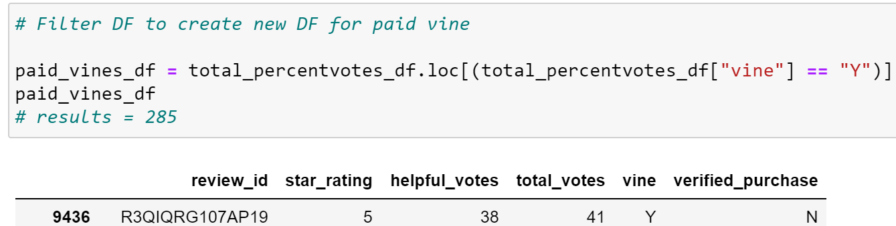
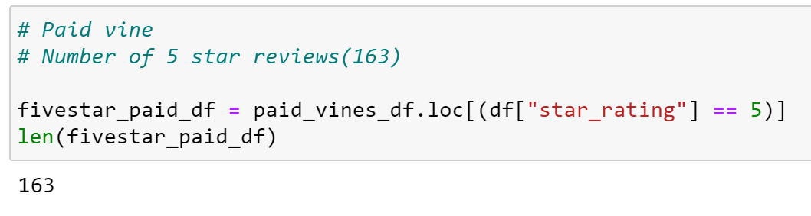
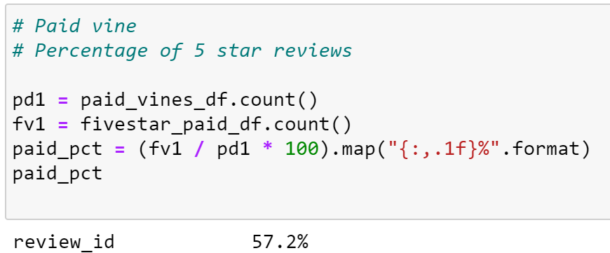
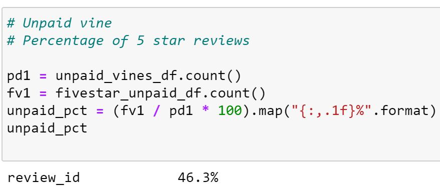

# Amazon_Vine_Analysis

# Module 16 - Big Data Challenge

# 1. Overview of the Analysis

Analyze Amazon reviews written by members of the paid Amazon
Vine program to determine if there is any bias toward favorable 
reviews from Vine members. The Vine Program is a service that allows
manufacturers and publishers to receive reviews for their products. 
Companies pay a small fee to Amazon and provide products to Amazon Vine member who are required to publish a review.

For the analysis, the dataset chosen from the list of Amazon 
Review Datasets was for Tools.

https://s3.amazonaws.com/amazon-reviews-pds/tsv/amazon_reviews_us_Tools_v1_00.tsv.gz

Steps to perform analysis are as follows:
- Select a dataset from Amazon reviews
- Create data frame tables using pgAdmin for customers, products,
review ids and vines
- Create a new database with Amazon RDS
- Create a new Amazon RDS database in pgAdmin to store data
in the separate Data Frames 
- Use PySpark for the ETL process to connect to Amazon RDS to load 
the data into pgAdmin
- Use Python/Jupyter Notebook to read in the vine dataset to perform the analysis (split paid vine and unpaid vine reviews, review 5 star reviews, calculate percentages).
 

# 2. Results

For each DataFrame, provide the following results.

- How many Vine reviews and non-Vine reviews were there?
The total number of Vine reviews is 285.

The total number of non-Vine reviews is 31,545.

- How many Vine reviews were 5 stars? How many non-Vine reviews were 
5 stars?

The number of 5 star Vine reviews is 163.

The number of 5 star non-Vine reviews is 14,614.

- What percentage of Vine reviews were 5 stars? What percentage of 
non-Vine reviews were 5 stars?

The percentage of 5 star Vine reviews is 57.2%.

The percentage of 5 star non-Vine reviews is 46.3%.

# Summary

The percentage difference with 5 star reviews between the Vine
program at 57.2% versus 46.3% in the non-Vine program indicates 
a positivity bias for the Vine program.

Statistical analysis using Mean-Median-Mode to
validate the positivity bias for the Vine program.

